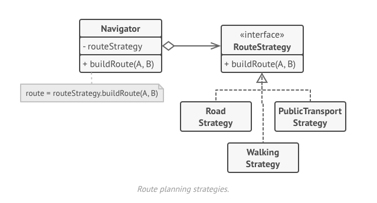

# Strategy design pattern

The Strategy Design Pattern is a behavioral pattern that allows you to define a family of algorithms, encapsulate them in separate classes, and make them interchangeable at runtime. It enables flexibility by letting the client choose an algorithm dynamically, without altering the code that uses it.

The Strategy pattern suggests that you take a class that does something specific in a lot of different ways and extract all of these algorithms into separate classes called strategies.

The original class, called context, must have a field for storing a reference to one of the strategies. The context delegates the work to a linked strategy object instead of executing it on its own.

The context isn’t responsible for selecting an appropriate algorithm for the job. Instead, the client passes the desired strategy to the context.  


## Key Concepts

**Context**: The main class that uses a strategy.  
**Strategy Interface**: Defines a common interface for all strategies.  
**Concrete Strategies**: Different implementations of the strategy interface.

## Example

```python
from abc import ABC, abstractmethod

# Step 1: Define the Strategy Interface
class PaymentStrategy(ABC):
    @abstractmethod
    def pay(self, amount):
        pass

# Step 2: Implement Concrete Strategies
class CreditCardPayment(PaymentStrategy):
    def pay(self, amount):
        print(f"Paid {amount} using Credit Card.")

class PayPalPayment(PaymentStrategy):
    def pay(self, amount):
        print(f"Paid {amount} using PayPal.")

class BitcoinPayment(PaymentStrategy):
    def pay(self, amount):
        print(f"Paid {amount} using Bitcoin.")

# Step 3: Define the Context Class
class PaymentContext:
    def __init__(self, strategy: PaymentStrategy):
        self.strategy = strategy

    def set_strategy(self, strategy: PaymentStrategy):
        self.strategy = strategy

    def execute_payment(self, amount):
        self.strategy.pay(amount)

# Step 4: Use the Strategy Pattern
if __name__ == "__main__":
    # Choosing a payment method dynamically
    payment = PaymentContext(CreditCardPayment())
    payment.execute_payment(100)

    payment.set_strategy(PayPalPayment())
    payment.execute_payment(200)

    payment.set_strategy(BitcoinPayment())
    payment.execute_payment(300)
```

## Real-world Use Cases

Sorting algorithms (different strategies like quicksort, mergesort, etc.)
Payment processing systems (credit card, PayPal, cryptocurrency)
Compression algorithms (ZIP, GZIP, RAR)
Authentication mechanisms (OAuth, JWT, Basic Auth)
[Reference-Strategy pattern](https://refactoring.guru/design-patterns/strategy)
