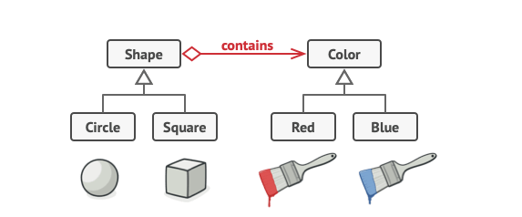

# Bridge design pattern

The Bridge Pattern is a structural design pattern that decouples an abstraction from its implementation, allowing both to evolve independently.

The Bridge pattern splits a large class or related classes into abstraction and implementation, allowing them to evolve independently.

## Why Use the Bridge Pattern?

- Avoids permanent binding between abstraction and implementation.

- Allows flexibility by enabling new abstractions or implementations without modifying existing code.
- Reduces complexity by dividing responsibilities.

## **Problem with Inheritance**  

When extending shape classes in **two independent dimensions** (e.g., **Shape** and **Color**), inheritance leads to a **class explosion** (e.g., `RedCircle`, `BlueCircle`, `RedSquare`, `BlueSquare`, etc.).

### **How the Bridge Pattern Solves This**  

1. **Switches from inheritance to composition.**  
2. **Separates concerns:**  
   - Extracts `Color` into its own hierarchy (`Red`, `Blue`, etc.).  
   - `Shape` holds a reference to a `Color` object instead of defining colors itself.  
3. **Creates a bridge** between `Shape` and `Color`, allowing independent modifications.  
4. **New colors or shapes** can be added **without modifying existing classes**.  

### **Example**  



Instead of:  

```plaintext
Circle + Red → RedCircle  
Circle + Blue → BlueCircle  
Square + Red → RedSquare  
Square + Blue → BlueSquare  
... (More combinations)  
```

We now have:  

```plaintext
Shape ─→ Color (Bridge)  
Circle ─→ Red  
Square ─→ Blue  
(New shapes and colors can be added independently!)  
```

This approach **simplifies the hierarchy**, improves **maintainability**, and **supports scalability**.

```python

from abc import ABC, abstractmethod

# Implementation Hierarchy (Color)
class Color(ABC):
    @abstractmethod
    def fill(self):
        pass

class Red(Color):
    def fill(self):
        return "Red Color"

class Blue(Color):
    def fill(self):
        return "Blue Color"

# Abstraction Hierarchy (Shape)
class Shape(ABC):
    def __init__(self, color: Color):
        self.color = color

    @abstractmethod
    def draw(self):
        pass

class Circle(Shape):
    def draw(self):
        return f"Drawing Circle in {self.color.fill()}"

class Square(Shape):
    def draw(self):
        return f"Drawing Square in {self.color.fill()}"


# Client Code
red_circle = Circle(Red())
blue_square = Square(Blue())

print(red_circle.draw())  # Output: Drawing Circle in Red Color
print(blue_square.draw()) # Output: Drawing Square in Blue Color


```

## Extras

[Refactoring Guru-Bridge pattern](https://refactoring.guru/design-patterns/bridge)

[Device <-> Remote](bridge_pattern.py) Python example
