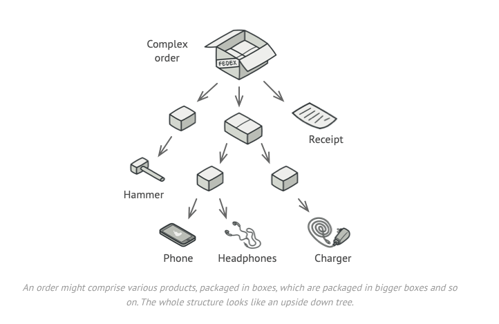

# Composite Design Pattern

Composite is a structural design pattern that lets you compose objects into tree structures and then work with these structures as if they were individual objects

The Composite Design Pattern is a structural pattern that allows treating individual objects and compositions of objects uniformly. It is used when you need to represent part-whole hierarchies, such as trees.

## Key Concepts

Component: An interface or abstract class that defines common methods for both simple and complex objects.
Leaf: Represents individual objects in the composition (no children).
Composite: A container that holds other components (leaf or composite), allowing tree-like structures.

##



## Example 1

```python
from abc import ABC, abstractmethod

# 1️⃣ Define Component Interface
class Employee(ABC):
    """Abstract class for all employees"""
    
    @abstractmethod
    def show_details(self, indent: int = 0):
        pass

#  2️⃣⃣ Implement Leaf ( Regular Employee as even CEO would be considered as employees)
class Developer(Employee):
    """Leaf node - Individual employee"""
    
    def __init__(self, name: str, position: str):
        self.name = name
        self.position = position

    def show_details(self, indent: int = 0):
        print(" " * indent + f"👨‍💻 {self.name} - {self.position}")

# 3️⃣ implement composite
class Manager(Employee):
    """Composite node - Can have other employees (developers or managers) under them"""
    
    def __init__(self, name: str, position: str):
        self.name = name
        self.position = position
        self.subordinates = []

    def add(self, employee: Employee):
        self.subordinates.append(employee)

    def show_details(self, indent: int = 0):
        print(" " * indent + f"👔 {self.name} - {self.position}")
        for employee in self.subordinates:
            employee.show_details(indent + 4)


```

## Extras

[Refactoring Guru Composite pattern](https://refactoring.guru/design-patterns/composite)

[Neurons Example](composite_design_pattern.py)
