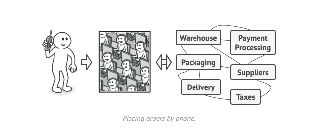

# Facade Design pattern

Facade is a structural design pattern that provides a simplified interface to a library, a framework, or any other complex set of classes.

The Facade Pattern simplifies interaction with complex subsystems by providing a single, unified interface. It hides implementation details, reduces dependencies, and improves maintainability.

✅ Problem: Directly using a complex library makes code tightly coupled and hard to manage.
✅ Solution: A facade class exposes only the needed functionality, making integration easier

## Real-World Analog


When you call a shop to place a phone order, an operator is your facade to all services and departments of the shop. The operator provides you with a simple voice interface to the ordering system, payment gateways, and various delivery services.

## Example

```python
# Subsystem classes
class CPU:
    def freeze(self):
        print("Freezing processor.")

    def jump(self, position):
        print(f"Jumping to: {position}")

    def execute(self):
        print("Executing instructions.")

class Memory:
    def load(self, position, data):
        print(f"Loading data '{data}' into position {position}.")

class HardDrive:
    def read(self, lba, size):
        return f"Data from sector {lba} with size {size}"

# Facade class
class ComputerFacade:
    def __init__(self):
        self.cpu = CPU()
        self.memory = Memory()
        self.hard_drive = HardDrive()

    def start_computer(self):
        self.cpu.freeze()
        boot_data = self.hard_drive.read(lba=0, size=1024)
        self.memory.load(position=0, data=boot_data)
        self.cpu.jump(position=0)
        self.cpu.execute()

# Client code
if __name__ == "__main__":
    computer = ComputerFacade()
    computer.start_computer()
```

## Explanation

Subsystem Classes: CPU, Memory, and HardDrive represent complex parts of a computer system with their specific operations.

Facade Class: ComputerFacade provides a simplified interface (start_computer) to initialize the complex interactions between the subsystem classes.

Client Code: The client interacts with the ComputerFacade, abstracting away the intricate details of subsystem interactions.

This pattern is particularly useful when dealing with complex systems, as it promotes ease of use and maintainability by providing a unified interface.
