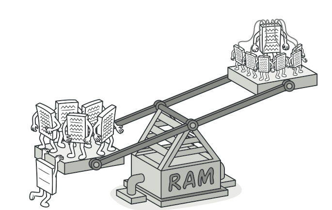

# Flyweight Design Pattern

The Flyweight pattern is used to reduce memory usage and improve performance by sharing common data between multiple objects instead of storing it separately. This is useful when creating a large number of similar objects.

A space optimization technique that lets us use less memory by storing externally the data associated with similar objects


## key Idea

Instead of creating duplicate objects with identical data, we reuse existing objects by storing shared information in a flyweight pool.

## 📌 When to Use Flyweight?

1. When an application creates a large number of objects that consume a lot of memory.
2. When many objects share the same state.  
3. When objects can be split into shared (intrinsic) and unique (extrinsic) states.

## 🏗️ Structure

The Flyweight pattern consists of:  
1️. Flyweight Interface – Defines methods that flyweight objects implement.  
2️. Concrete Flyweight – Stores and shares the intrinsic state (common data).  
3️. Flyweight Factory – Manages flyweight objects and ensures reuse.  
4️. Client – Uses flyweight objects and passes unique (extrinsic) data.

## Example (Text Editor)

```python
from typing import Dict

# 1️⃣ Flyweight Class
class Character:
    def __init__(self, char: str, font: str, size: int, color: str):
        self.char = char  # Intrinsic state (shared)
        self.font = font
        self.size = size
        self.color = color

    def display(self, position: int):
        print(f"Displaying '{self.char}' at position {position} with font={self.font}, size={self.size}, color={self.color}")

# 2️⃣ Flyweight Factory
class CharacterFactory:
    _characters: Dict[str, Character] = {}

    @classmethod
    def get_character(cls, char: str, font: str, size: int, color: str):
        """Creates or reuses a flyweight Character object."""
        key = (char, font, size, color)
        if key not in cls._characters:
            cls._characters[key] = Character(char, font, size, color)
        return cls._characters[key]  # Return shared character

# 3️⃣ Client Code
def main():
    factory = CharacterFactory()
    
    text = "HELLO WORLD"
    positions = range(len(text))

    # Reuse flyweight objects for same characters
    for char, pos in zip(text, positions):
        character = factory.get_character(char, "Arial", 12, "Black")
        character.display(pos)
```

## Drawbacks

❌ Complexity Increases – Managing shared objects requires careful design.  
❌ Not Always Beneficial – If objects have too many unique attributes, sharing may not help.

## Extras

[Refactor Guru - Flyweight](https://refactoring.guru/design-patterns/flyweight)
